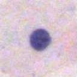
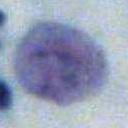
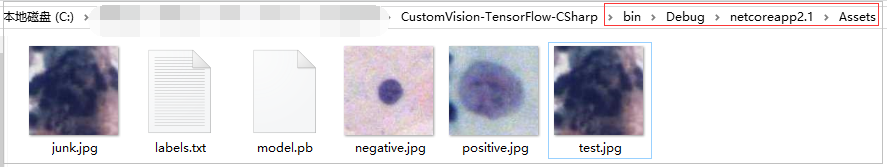
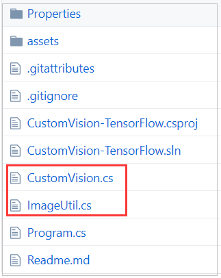
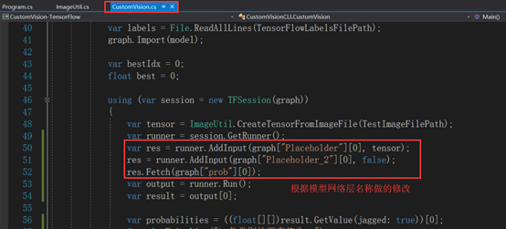
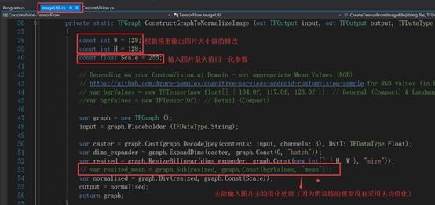
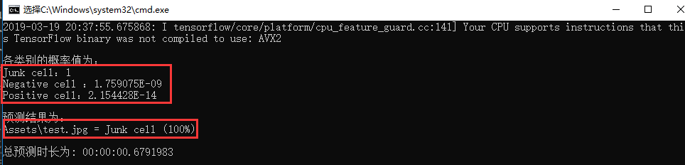

# C#调用PB模型

Fork from https://github.com/daltskin/CustomVision-TensorFlow-CSharp

**说明**：pb模型是什么以及为什么要使用pb模型，请参考[这里](https://github.com/JiaShengLiu111/MyBlog/blob/master/C%23%E8%A7%A3%E6%9E%90%E5%B9%B6%E8%B0%83%E7%94%A8PB%E6%A8%A1%E5%9E%8B.md)，我们不做过多的说明。这里我们只分享如何使用[CustomVision-TensorFlow-CSharp](https://github.com/daltskin/CustomVision-TensorFlow-CSharp)调用我们自己的pb模型。

#### 我们的应用场景：

单个宫颈细胞图像分类，是一个三分类任务，三个类别分别是：垃圾细胞（Junk）、正常细胞（Negative）、异常细胞（Positive）三个类别的示例图片分别如下图所示：



首先，使用大量带标签的数据集训练出分类器，并将模型保存为pb格式。请参考[这里](https://github.com/JiaShengLiu111/MyBlog/blob/master/ckpt%E6%A8%A1%E5%9E%8B%E8%BD%AC%E4%B8%BApb%E6%A8%A1%E5%9E%8B%E7%9A%84%E6%96%B9%E6%B3%95%2Btensorflow%E5%B0%86%E6%A8%A1%E5%9E%8B%E4%BF%9D%E5%AD%98%E4%B8%BApb%E6%A0%BC%E5%BC%8F%E7%9A%84%E6%96%B9%E6%B3%95.md)。

#### 针对我们自身的网络结构对[CustomVision-TensorFlow-CSharp](https://github.com/daltskin/CustomVision-TensorFlow-CSharp)进行修改：

**替换文件**：将CustomVision-TensorFlow-CSharp中的model.pb、test.jpg、labels.txt替换为自己相应的文件，如下图所示：



**修改代码**：项目的目录结构如下图所示，其中被红色方框框住的两个文件是需要修改的文件：



##### CustomVision.cs修改如下图所示：

为网络模型的placeholder赋值：



上图中的Placeholder以及Placeholder_2实际为网络结构中定义的placeholder的名字，在定义网络结构时可以通过如下方式指定placeholder的名字：

```
inputs = tf.placeholder(tf.float32, [None, 224, 224, 3],name="inputs")  
labels = tf.placeholder(tf.float32, [None, self.class_num],name="labels")
is_training = tf.placeholder(tf.bool,name="is_training")
```

假如没有特别为placeholder指定名字，tensorflow也会为placeholder指定默认的名字，可以直接将placeholder tensor打印出来如下所示：

```
print inputs
print labels
print is_training

# 打印结果
Tensor("Placeholder:0", shape=(?, 128, 128, 3), dtype=float32)
Tensor("Placeholder_1:0", shape=(?, 3), dtype=float32)
Tensor("Placeholder_2:0", dtype=bool)
```

假如已经生成好了pb模型，但是确实不知道placeholder的name，可以通过[这里]()查看pb模型各网络层的name。

##### ImageUtil.cs修改如下图所示：

根据模型输入图片的长宽修改如下W、H变量，同时该函数还提供对输入图片**去均值化**、**最大值归一化**等操作。




#### 运行结果如下所示：




