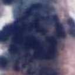

# C#调用PB模型

Fork from https://github.com/daltskin/CustomVision-TensorFlow-CSharp

**说明**：pb模型是什么以及为什么要使用pb模型，请参考[这里](https://github.com/JiaShengLiu111/MyBlog/blob/master/C%23%E8%A7%A3%E6%9E%90%E5%B9%B6%E8%B0%83%E7%94%A8PB%E6%A8%A1%E5%9E%8B.md)，我们不做过多的说明。这里我们只分享如何使用[CustomVision-TensorFlow-CSharp](https://github.com/daltskin/CustomVision-TensorFlow-CSharp)调用我们自己的pb模型。

#### 我们的应用场景：

单个宫颈细胞图像分类，是一个三分类任务，三个类别分别是：垃圾细胞（Junk）、正常细胞（Negative）、异常细胞（Positive）三个类别的示例图片分别如下图所示：

首先，使用大量带标签的数据集训练出分类器，并将模型保存为pb格式。请参考[这里](https://github.com/JiaShengLiu111/MyBlog/blob/master/ckpt%E6%A8%A1%E5%9E%8B%E8%BD%AC%E4%B8%BApb%E6%A8%A1%E5%9E%8B%E7%9A%84%E6%96%B9%E6%B3%95%2Btensorflow%E5%B0%86%E6%A8%A1%E5%9E%8B%E4%BF%9D%E5%AD%98%E4%B8%BApb%E6%A0%BC%E5%BC%8F%E7%9A%84%E6%96%B9%E6%B3%95.md)。

#### 针对我们自身的网络结构对[CustomVision-TensorFlow-CSharp](https://github.com/daltskin/CustomVision-TensorFlow-CSharp)进行修改：